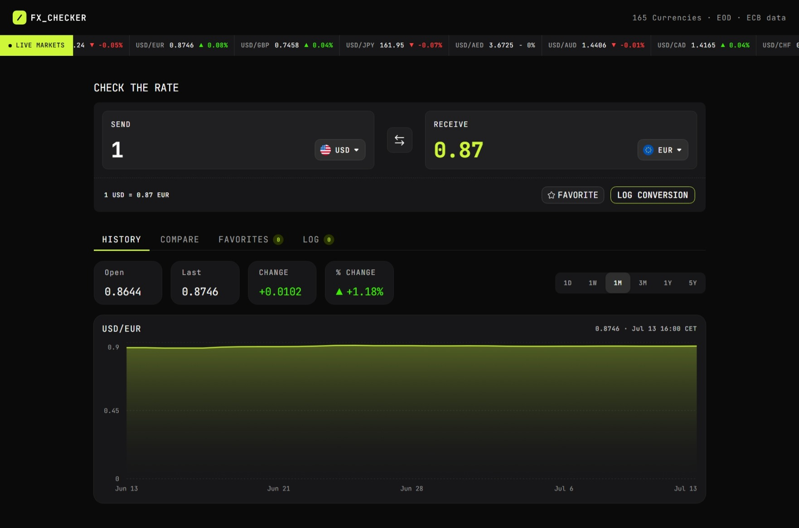

# Frontend Mentor - FX Checker solution

This is a solution to the [FX Checker challenge on Frontend Mentor](https://www.frontendmentor.io/challenges/foreign-exchange-currency-converter).

## Table of contents

- [Overview](#overview)
  - [The challenge](#the-challenge)
  - [Features](#features)
  - [Screenshot](#screenshot)
  - [Links](#links)
- [Setup Project Locally](#setup-project-locally)
- [My process](#my-process)
  - [Built with](#built-with)
  - [What I learned](#what-i-learned)
  - [Continued development](#continued-development)
  - [Useful resources](#useful-resources)
- [Author](#author)
- [Acknowledgments](#acknowledgments)

## Overview

### The challenge

Build a modern foreign exchange currency converter that allows users to convert currencies, explore historical exchange rates, compare currencies, and keep track of their favorite pairs and conversion history.

### Features

#### Converter

- Enter an amount to send and see it convert in real time as they type
- Pick the "send" and "receive" currencies from a searchable currency picker
- See the live exchange rate for the active pair (for example, `1 USD = 0.8530 EUR`)
- Swap the send and receive currencies with the swap button
- Favorite the active pair, and log a conversion to their history

#### Currency picker

- Search the full list of available currencies by code or name
- See currencies grouped into "Popular" and "Other currencies", each row showing the flag, code, and name
- See a check against the currency that's currently selected

#### Live markets ticker

- See a ticker of currency pairs, each with its current rate and 24-hour change (up or down)

#### Rate history

- View a line and area chart of the active pair's rate over time
- Switch the chart range between 1D, 1W, 1M, 3M, 1Y, and 5Y
- See the open, last, absolute change, and percentage change for the selected range

#### Compare

- See their send amount converted into a range of other currencies at once, each with its reference rate
- Pin or unpin any comparison row to their favorites

#### Favorites

- See their pinned pairs, each with its live rate and 24-hour change
- Load a pinned pair back into the converter by selecting its row
- Unpin a pair they no longer want to track

#### Conversion log

- See a log of conversions they've made, each showing the relative time, the pair, and the send and receive amounts
- Clear the whole log
- Delete an individual entry

#### UI & accessibility

- View the optimal layout for the interface depending on their device's screen size
- See hover and focus states for all interactive elements on the page
- Navigate the entire app using only their keyboard

<!-- ### Screenshot

 -->

### Links

- Solution URL: [Solution URL](https://github.com/halelite/FX-converter.git)
- Live Site URL: [Live site URL](https://fx-converter-ebon.vercel.app/)

## Setup Project Locally

Clone the repository:

```bash
git clone https://github.com/halelite/FX-converter.git
```

Navigate to the project directory:

```bash
cd FX-converter
```

Install dependencies:

```bash
npm install
```

Start the development server:

```bash
npm run dev
```

Open [http://localhost:3000](http://localhost:3000) in your browser.

## My process

### Built with

- [Next.js](https://nextjs.org/) - React framework for building full-stack web applications
- [Tailwind CSS](https://tailwindcss.com/) - Static type checking for safer and more maintainable code
- [Shadcn](https://ui.shadcn.com/) - Accessible, customizable UI components
- [Motion](https://motion.dev/) - Animation library for smooth UI interactions and transitions
- [date-fns](https://motion.dev/) - Modern utility library for date manipulation and formatting
- [decimal.js](https://mikemcl.github.io/decimal.js/) - Arbitrary-precision decimal arithmetic for accurate currency calculations

### What I learned

Working on this project helped me gain a deeper understanding of:

- Structuring helper functions by separating data fetching from data transformation.
- Building reusable React components with clear responsibilities.
- Managing asynchronous data fetching and loading states.
- Working with historical exchange rate data and calculating rate changes over different time ranges.
- Using URL search parameters to create clean and flexible API requests.
- Improving accessibility through keyboard navigation and semantic UI components.

### Continued development

In future iterations of this project, I'd like to expand its functionality by:

- Integrating a database to persist user data such as favorites and conversion history across devices and sessions.
- Adding a theme switcher with light and dark mode support while maintaining accessibility and a consistent user experience.
- Exploring client-side caching strategies to improve performance and reduce unnecessary API requests.
- Continuing to improve accessibility by implementing more advanced patterns and testing with assistive technologies.

### Useful resources

- Frankfurter API – Used for live and historical exchange rate data.
- Next.js Documentation – Helpful for working with the App Router and Server Components.
- shadcn/ui – Provided accessible and customizable UI components.
- Tailwind CSS Documentation – Used extensively for styling and responsive layouts.
- date-fns Documentation – Simplified date calculations for historical ranges.

## Author

- Frontend Mentor - [@halelite](https://www.frontendmentor.io/profile/halelite)
- LinkedIn - [Hale Sheikhi](https://www.linkedin.com/in/hale-sheikhi/)

## Acknowledgments

A huge thank you to Frontend Mentor for organizing the **FM30 Hackathon** and creating such a fun and challenging project. The challenge provided an excellent opportunity to build a real-world application while exploring modern React, Next.js, and TypeScript patterns.
